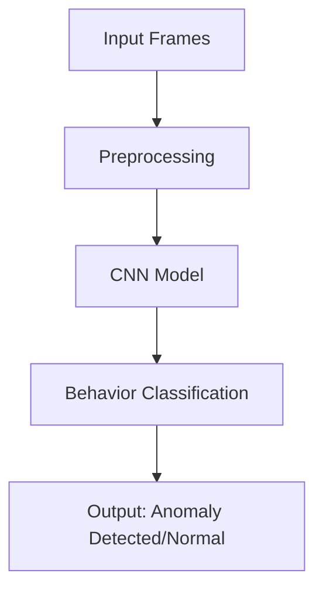

# 🎥 Anomaly Detection System for Offline Exam Monitoring

https://anomalydetectionexammonitoring.streamlit.app/

[](https://opensource.org/licenses/MIT)
[](https://www.python.org/)
[](https://streamlit.io/)

---

## 📑 Table of Contents

- [Introduction](#introduction)
- [Technology Stack](#technology-stack)
- [Features](#Features)
- [Project Workflow](#project-workflow)
- [Dataset Preparation](#Dataset-Preparation)
- [Model Training](#Model-Training)
- [Inferencing](#inferencing)
- [Usage](#usage)
  - [Prerequisites](#prerequisites)
  - [Setup Instructions](#setup-instructions)
  - [Using the Application](#using-the-application)
- [License](#license)

---

## 📖 Introduction

Welcome to the **Anomaly Detection System for Offline Exam Monitoring** project!

IThe Anomaly Detection System for Offline Exam Monitoring is designed to analyze recorded exam videos and detect unusual activities such as cheating behaviors. Using deep learning techniques, particularly Convolutional Neural Networks (CNNs), the system classifies behaviors into predefined categories like copying, cheat passing , Suspicious , Using Copy Cheat, Peeking , using mobile phones, discussing, and normal behavior.

**Why is this important?**

- **Improved Exam Integrity:** Helps in identifying misconduct effectively.
- **Post-Exam Analysis:** Allows administrators to review flagged behaviors.
- **Automation:** Reduces manual effort in analyzing hours of footage.

---

## Features

- **Automated Detection:** Identifies abnormal activities in recorded exam footage.
- **Deep Learning-Based:** Uses CNN models trained on labeled behavioral datasets.
- **User-Friendly Interface:** Displays detected anomalies for review.

## 🛠️ Technology Stack

We have utilized a modern and robust technology stack to ensure scalability and performance:

- **Programming Language**: [Python 3.x](https://www.python.org/)
- **Computer Vision**: [OpenCV](https://opencv.org/)
- **Data Processing**: [Pandas](https://pandas.pydata.org/), [NumPy](https://numpy.org/)
- **Data Visualization**: [Matplotlib](https://matplotlib.org/), [Seaborn](https://seaborn.pydata.org/)
- **Machine Learning**: [Scikit-learn](https://scikit-learn.org/stable/)
- **Machine Learning Framework** :[TensorFlow](https://www.tensorflow.org/), [Keras](https://keras.io/api/)
- **Deep Learning Model**: Convolutional Neural Networks (CNNs)
- **Model Persistence**: [h5 file](https://keras.io/api/models/model_saving_apis/)
- **Web Framework**: [Streamlit](https://streamlit.io/)
- **Version Control**: [Git](https://git-scm.com/)
- **Development Environment**: [Jupyter Notebooks](https://jupyter.org/), [Pycharm](https://www.jetbrains.com/pycharm/)

---

## 📈 Project Workflow

Our project follows a structured workflow to ensure clarity and efficiency:

1. **Dataset Collection & Labeling**📊

   - Extract frames from exam videos.
   - Label images with behavioral categories (e.g., normal, copying, discussing, etc.).

2. **Preprocessing & Augmentation** ⚙️

   - Convert images to grayscale.
   - Resize images for CNN input.
   - Remove duplicate frames.

3. **Model Training** 🤖

- Train a CNN model on labeled data.
- Perform hyperparameter tuning to optimize accuracy.
- Save the trained model in **.h5** format for deployment

4.  **Testing & Evaluation** 🧪

- Evaluate model performance on a test dataset.
- Fine-tune to minimize false positives/negatives.
- Load the trained model from H5 file in Streamlit application

5.  **Deployment & Inference**📌

- Process new video frames for anomaly detection.
- Output results in a structured format for review.

---

## 📂 Dataset Preparation

- The dataset consists of frames extracted from exam videos, labeled with 9 behavioral categories.
- Labels include 'copying' , 'cheat passing' , 'Suspicious' , 'Using Copy Cheat', 'Peeking' , 'using mobile phones', 'discussing' , and 'normal' behavior.
- Preprocessing steps ensure consistency in image size and format.

**Preprocessing Steps**

- **Frame Extraction**: Ensuring no duplicate frames.
- **Resizing and Grayscale Conversion**: For CNN compatibility.
- **Data Augmentation**: To improve model generalization.

## 🎯 Model Training

Our predictive modeling process is designed for accuracy:

- **Algorithm Selection**: **Convolutional Neural Network (CNN)**

  - **Reasons:**
    - Excels at image classification tasks.
    - Learns spatial hierarchies of features automatically.
    - Robust against variations in input frames.

- **Model Training:**

  - Data split into training and validation sets.
  - Augmentation applied to enhance generalization.
  - Hyperparameters tuned using grid search and Optimized using Adam optimizer and categorical cross-entropy loss.
  - Model is saved as an H5 file (model.h5) for deployment.

- **Evaluation Metrics:**
  - **Accuracy** : Measures overall classification correctness.
  - **Precision, Recall, F1-score** : Evaluates performance per class.
  - **Confusion Matrix**: Identifies misclassification patterns.

**Model Architecture Diagram:**



## 🔍 Inferencing

The deployed model is accessible through an interactive web application:

- **User Interface**: Built with **Streamlit** for a seamless experience.
- **Offline Video Analysis**: The system processes recorded exam footage for anomaly detection.
- **Model Loading**: The trained CNN model is loaded from the H5 file (model.h5) for making predictions.
- **Output**: Generates the processed video with anomaly detected and its confidence score.

---

## 🚀 Usage

### ✅ Prerequisites

Ensure you have the following installed:

- **Python 3.x**
- **Python Libraries**:

  - `pandas`
  - `numpy`
  - `scikit-learn`
  - `keras`
  - `tensorflow`
  - `streamlit`

  - **Install dependencies using:**

  ```bash
  pip install tensorflow opencv-python numpy pandas matplotlib
  ```

### 📝 Setup Instructions

**Follow these steps to get the project up and running:**

1. **Clone the Repository**

   ```bash
   git clone https://github.com/yourusername/Anomaly-detection-system.git
   cd Anomaly-detection-system
   ```

2. **Create a Virtual Environment**

   ```bash
   python3 -m venv env
   source env/bin/activate  # For Windows: env\Scripts\activate
   ```

3. **Install Dependencies**

   ```bash
   pip install -r requirements.txt
   ```

4. **Directory Structure**

   Your project should have the following structure:

   ```
   anomaly-detection-system/
   ├── data/
   │   ├── uploaded_videos/
   │   ├── processed_videos/
   ├── models/
   │   ├── anomaly_model.h5
   │   ├── multi_class_anomaly.h5
   ├── training/
   │   ├── train.py
   ├── app.py
   ├── requirements.txt
   ├── README.md
   ```

5. **Train the Model**

   ```bash
   cd codebase
   python train.py
   ```

   - This script will preprocess the data and train the model.

6. **Run the Streamlit App**

   ```bash
   streamlit run app.py
   ```

7. **Access the Application**

   - Open your web browser and navigate to `http://localhost:8501`.

### ▶️ Using the Application

**Step-by-Step Guide:**

1. **Navigate to the Application**

   - Open your browser and go to `http://localhost:8501`.

2. **Home Page**

   - The Home section provides an overview of the system and its purpose.

3. **Detection Page**

   - Click on the Upload button to select a recorded exam video.
   - The system will process the video while showing a progress bar.
   - Once processing is complete, the system will display:
     - **Processed Video**: The video with detected anomalies highlighted.
     - **Anomaly Details**: A report containing detected anomalies and their confidence scores.

4. **History Page**

   - Stores all previously processed videos along with timestamps.
   - Users can revisit and review past anomaly detection results.

5. **About Page**

   - Provides information about the project, its objectives, and how it works.

---

## 📚 License

This project is licensed under the **MIT License** - see the [LICENSE](LICENSE) file for details.

---
